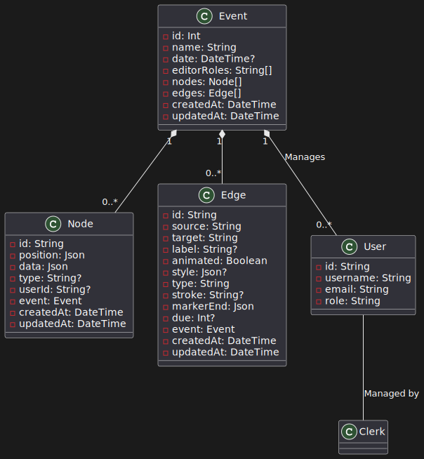

# ClubInterFlow for '89 Website Specification

## Overview
ClubInterFlow for '89 is an event planner and management website designed to streamline the organization process for club events. Its main feature is a dynamic workflow chart that allows certain users to edit and create new charts representing events. The charts consist of nodes representing people responsible for organizing the event, and edges representing tasks with due dates. The website also includes additional features such as a timetable, gallery, book of regulations version history, donation platform, and inventory management.

## Features

### Dynamic Workflow Chart:
- Users with appropriate permissions can create, edit, and delete workflow charts for event planning.
- Nodes represent individuals responsible for various tasks during the event (e.g., PR Manager).
- Edges between nodes represent tasks with due dates, facilitating task management.
- Color coding for better visualization and organization.
- Integration with email notifications to alert responsible users about their tasks.

### Timetable:
- Users can create, edit, and delete events and tasks.
- Option for integration with Outlook Calendar or Google Calendar for enhanced scheduling capabilities.

### Gallery:
- Allows users to upload, delete, organize, and display photos and videos from previous events, facilitating event documentation and promotion.

### Book of Regulations Version History:
- Maintains a record of approved versions of club regulations accessible to all members.
- Users can compare different versions and upload updated versions as necessary.

### Donation Platform:
- Enables alumni and other supporters to donate to the club, providing financial support for events and club activities.

### Inventory Management:
- Provides functionality for managing catering, creative inventory, and tools.
- Users can add, edit, delete, and search inventory items to ensure smooth event operations.

## API Endpoints

### Get All Events:
- Endpoint: `/api/events`
- Method: GET
- Description: Retrieve a list of all events stored in the database. This endpoint allows users to browse through all events available on the website.

### Get Event by ID:
- Endpoint: `/api/events/{id}`
- Method: GET
- Description: Retrieve a specific event by its unique identifier. This endpoint allows users to view detailed information about a particular event.

### Create Event:
- Endpoint: `/api/events`
- Method: POST
- Description: Create a new event in the database. Users can use this endpoint to add new events to the website.

### Update Event:
- Endpoint: `/api/events/{id}`
- Method: PUT or PATCH
- Description: Update an existing event in the database. Users can use this endpoint to modify event details such as name, date, editor roles, etc.

### Delete Event:
- Endpoint: `/api/events/{id}`
- Method: DELETE
- Description: Delete a specific event from the database. This endpoint allows users to remove events that are no longer needed.

## Technology Stack
- Next.js React framework for front-end development.
- JavaScript for scripting functionalities.
- NextUI UI framework for user interface design.
- Database:
  - PostgreSQL for data storage.
  - Prisma for database ORM (Object-Relational Mapping).
- Authentication:
  - Clerk authentication service for user authentication and authorization.

## Data Model
- The data model includes entities such as Event, Node, and Edge to represent events, individuals involved, and task dependencies.

### Event Model:
- Attributes: id, name, date, editorRoles, nodes, edges, createdAt, updatedAt.

### Node Model:
- Attributes: id, position, data, type, userId, eventId, createdAt, updatedAt.

### Edge Model:
- Attributes: id, source, target, label, animated, style, type, stroke, markerEnd, due, eventId, createdAt, updatedAt.

## Example Implementation
- Users can create events and corresponding workflow charts using the provided example data and API calls to Prisma for data creation and retrieval.

## Conclusion
ClubInterFlow for '89 is a comprehensive event planner and management website designed to simplify the organization process for club events. With its dynamic workflow chart, timetable, gallery, version history, donation platform, and inventory management features, it provides users with the tools they need to plan and execute successful events efficiently.
